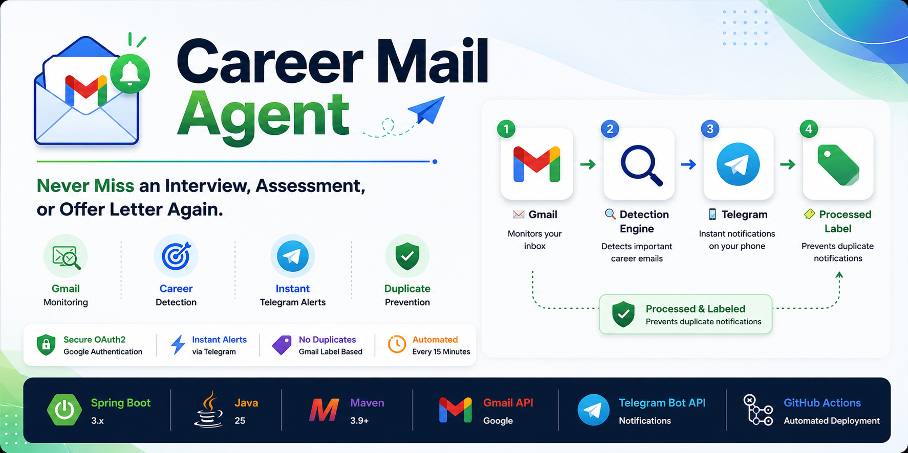

  

<h1 align="center">📧 Career Mail Agent</h1>

<b>Never Miss an Interview, Assessment, or Offer Letter Again.</b>

A production-ready Spring Boot automation tool that continuously monitors Gmail, detects career-related emails, instantly sends Telegram notifications, and intelligently prevents duplicate alerts using Gmail labels.

---

> 🚧 Documentation is currently being expanded.
>
> A complete setup guide, architecture diagrams, screenshots, and developer documentation will be added soon.
